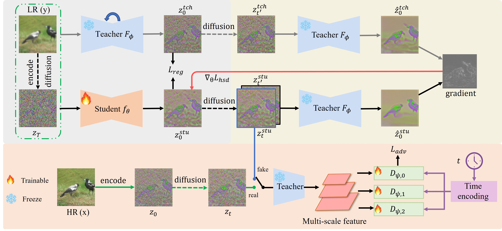

# One Step Diffusion-based Super-Resolution with Time-Aware Distillation
Welcome! This is the official implementation of the paper "[One Step Diffusion-based Super-Resolution with Time-Aware Distillation](https://arxiv.org/pdf/2408.07476.pdf)".

- Xiao He $^1$, Huaoao Tang $^2$, Zhijun Tu $^2$, Kun Cheng $^1$, Hanting Chen $^2$, Yong Guo $^3$, Mingrui Zhu $^1$, Nannan Wang $^1$, Xinbo Gao $^4$, Jie Hu $^2$

- $^1$ Xidian University, $^2$  Huawei Noah’s Ark Lab, $^3$ Consumer Business Group, Huawei, $^4$  Chongqing University of Posts and Telecommunications


  

Figure 4: **Method overview**. We train student model to map noisy latent to clean latent through
one step sampling. To match the student model’s output with the multi-step sampling outputs of the
teacher model, we optimize the student model using both regression loss and our proposed hsd loss.
Additionally, to further improve the performance of the student model, we propose a time-aware
discriminator that provides effective supervision through adversarial training.
## ⚙️ Requirements
* Python 3.10, Pytorch 2.1.2, [xformers](https://github.com/facebookresearch/xformers) 0.0.23
* More detail (See [environment.yml](environment.yml))
A suitable [conda](https://conda.io/) environment named `TAD-SR` can be created and activated with:

```
conda env create -n TAD-SR python=3.10
conda activate TAD-SR
pip install -r requirements.txt
```
or
```
conda env create -f environment.yml
conda activate TAD-SR
```

## 🚀 Fast Testing
#### :tiger: Real-world image super-resolution
```sh
python3 inference.py -i [image folder/image path] -o [result folder] --ckpt weights/TAD-SR.pth --scale 4 --one_step --task realsrx4
```

#### :octopus: Blind Face Restoration
```sh
python3 inference.py -i [image folder/image path] -o [result folder] --ckpt weights/TAD-faceir.pth --scale 1 --one_step --task faceir
```

## :dolphin: Reproducing the results in the paper

### Results in Table 2
- Download the image ImageNet-Test [(Link)](https://drive.google.com/file/d/1NhmpON2dB2LjManfX6uIj8Pj_Jx6N-6l/view?usp=sharing) to the [testdata](testdata) folder.
- Unzip the downloaded dataset.
- Test the model
```sh
python inference.py -i testdata/imagenet256/lq/ -o results/TAD-SR/imagenet  -r testdata/imagenet256/gt/ --scale 4 --ckpt weights/TAD-SR.pth --one_step --task realsrx4

```

### Results in Table 3
- Real data for image super-resolution: [RealSet65](testdata/RealSet65) | [RealSR](testdata/RealSR)
- Test the model
```sh
# Results on RealSet65
python inference.py -i testdata/RealSet65 -o results/TAD-SR/RealSet65 --scale 4 --ckpt weights/TAD-SR.pth --one_step --task realsrx4


# Results on RealSR
python inference.py -i testdata/RealSet65 -o results/TAD-SR/RealSR --scale 4 --ckpt weights/TAD-SR.pth --one_step --task realsrx4

```
If you are running on a GPU with limited memory, you could reduce the patch size by setting ```--chop_size 256``` to avoid out of memory. However, this will slightly degrade the performance.
```sh
# Results on RealSet65
python inference.py -i testdata/RealSet65 -o results/TAD-SR/RealSet65 --scale 4 --ckpt weights/TAD-SR.pth --one_step --chop_size 256 --task realsrx4

# Results on RealSR
python inference.py -i testdata/RealSR -o results/TAD-SR/RealSR --scale 4 --ckpt weights/TAD-SR.pth --one_step --chop_size 256 --task realsrx4
```

### Results in Table 4
- Download the image CelebA-Test [(Link)](https://drive.google.com/file/d/15Ij-UaI8BQ7fBDF0i4M1wDOk-bnn_C4X/view?usp=drive_link) to the [testdata](testdata) folder.
- Unzip the downloaded dataset.
- Test the model
```sh
python inference.py -i testdata/CelebA-Test/lq/ -o results/TAD-faceir/CelebA-Test  -r testdata/CelebA-Test/hq/ --scale 1 --ckpt weights/TAD-faceir.pth --one_step --task faceir

```

### Results in Table 5
- Download WebPhoto-Test [(Link)](https://1drv.ms/u/s!AkGVnRhFUbx2hLUHkv8QhhLwD8yd1g?e=ecNWSZ), LFW-Test [(Link)](https://1drv.ms/u/s!AkGVnRhFUbx2hZ4yb_Ly5NTopkyY8w?e=abk8bf) and Wider-Test datasets [(Link)](https://drive.google.com/file/d/1g05U86QGqnlN_v9SRRKDTU8033yvQNEa/view?usp=sharing) to the [testdata](testdata) folder.
- Unzip the downloaded dataset.
- Test the model
```sh
# Results on WebPhoto-Test
python inference.py -i testdata/WebPhoto-Test -o results/TAD-faceir/WebPhoto-Test  --scale 1 --ckpt weights/TAD-faceir.pth --one_step --task faceir


# Results on LFW-Test
python inference.py -i testdata/cropped_faces -o results/TAD-faceir/LFW-Test  --scale 1 --ckpt weights/TAD-faceir.pth --one_step --task faceir


# Results on Wider-Test
python inference.py -i testdata/wider -o results/TAD-faceir/Wider-Test  --scale 1 --ckpt weights/TAD-faceir.pth --one_step --task faceir


```

## :turtle: Training
### Preparing stage
1. Download the necessary pre-trained model [(Link)](https://github.com/zsyOAOA/ResShift/releases), i.e., pretrained ResShift, and Autoencoder. This can be achieved by inferece using ResShift and the needed models will be downloaded automatically.
```sh
python inference --task realsrx4 -i [image folder/image path] -o [result folder] --scale 4 --model_version resshift_realsr # Real-world super-resolution

python inference --task faceir -i [image folder/image path] -o [result folder] --scale 1 --model_version resshift_faceir # Blind face restoration
```
1. Adjust the data path in the config file. 
2. Adjust batchsize according your GPUS.
    + configs.train.batch: [training batchsize, validation btatchsize]
    + configs.train.microbatch: total batchsize = microbatch * #GPUS 
### Train the model

#### Real-world Image Super-resolution
```sh
python3 main_distill.py --cfg_path configs/TAD-SR.yaml --save_dir logs/TAD-SR
```

#### Blind face restoration
```sh
python3 main_distill.py --cfg_path configs/TAD-faceir.yaml --save_dir logs/TAD-faceir
```

## Distillation on SeeSR
We also provide code for distilling SeeSR into a single sampling step; detailed information can be found in [here]( https://github.com/LearningHx/TAD-SR/tree/main/TAD-SeeSR).

## :heart: Acknowledgement

This project is based on [ResShift](https://github.com/zsyOAOA/ResShift) [SinsSR](https://github.com/wyf0912/SinSR), [SeeSR](https://github.com/cswry/SeeSR) and [AddSR](https://github.com/NJU-PCALab/AddSR). Thanks for the help from the author.

## :star: Citation
Please cite our paper if you find our work useful. Thanks! 
```
@article{he2024one,
  title={One Step Diffusion-based Super-Resolution with Time-Aware Distillation},
  author={He, Xiao and Tang, Huaao and Tu, Zhijun and Zhang, Junchao and Cheng, Kun and Chen, Hanting and Guo, Yong and Zhu, Mingrui and Wang, Nannan and Gao, Xinbo and Hu, Jie},
  journal={arXiv preprint arXiv:2408.07476},
  year={2024}
}
```

## :email: Contact
If you have any questions, please feel free to contact me via `xiaohe@stu.xidian.edu.cn`.
